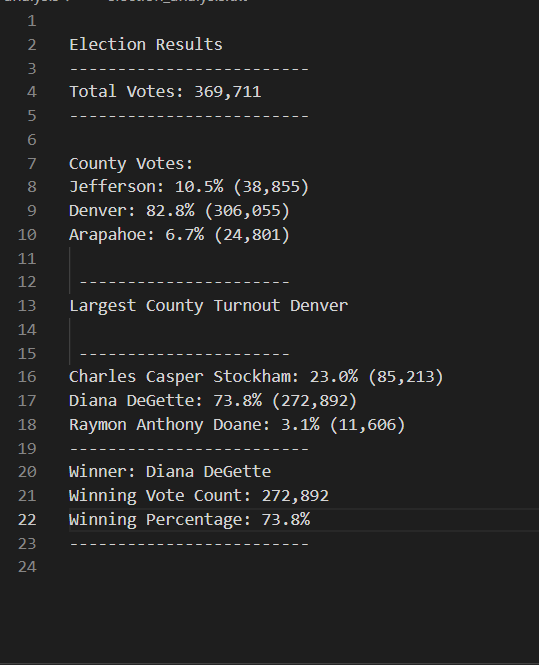

## Election Audit

### Tom and Seth want our final Python script to be able to deliver the following information when the script is run for the recent local congressional election audit:

•	Total number of votes cast

•	A complete list of candidates who received votes

•	Which county had the largest number of votes

•	Total number of votes each candidate received

•	Percentage of votes each candidate won

•	The winner of the election based on popular vote

## Resource 
•	Data Source (provided by Tom and Seth)- election results.csv

•	Software/ program used- python 3.7 and Visual Studio code

## The Election Results

## Summery 
Diana Degette is the clear winner with 73.8% of the votes, totaling 272,892 votes counted!!!
Congratulation to Diana!!

Later on when and if Tom and Seth are assgined other or future election they can just run this script to find the results faster. We modified the orginal script to find the largest County turnout, so if the commison comes back and ask for a even more detailed report we can do that.
Lets say they want to find how many votes and percentage each candidate got in each county, we can just added another "if condidntion" in this script and print that to our "election result.txt"
or lets say they they want to find the total votes and percentage of each candidate for each State, all we would have to do is just change the "County" to "State"
